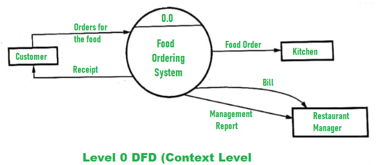
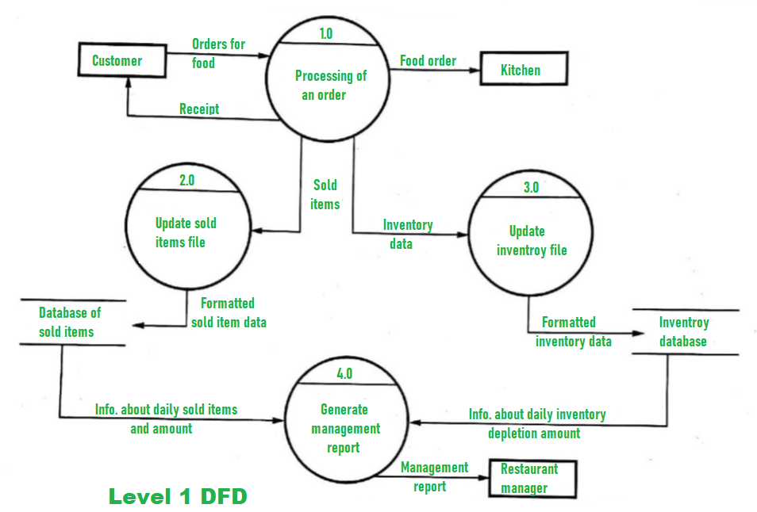
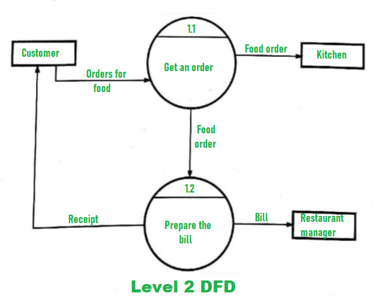

# Assignment 2 Answers

## 1. What are the rules that should be followed when creating the analysis model.

To create an effective analysis model in software engineering, follow these key rules:

1. **Focus on Business Requirements:**
   - Emphasize requirements within the business domain, maintaining a high level of abstraction.

2. **Relevant Elements:**
   - Include elements that contribute to understanding software requirements, covering information, functions, and system behavior.

3. **Delay Infrastructure Details:**
   - Postpone detailed infrastructure and nonfunctional considerations to avoid design delays.

4. **Minimize Coupling:**
   - Keep interconnections between modules (coupling) to a minimum for enhanced modularity.

5. **Stakeholder Value:**
   - Ensure the analysis model provides value to all stakeholders involved in the project.

6. **Simplicity is Key:**
   - Strive for a simple model to facilitate easy understanding and clear communication of requirements.

## 2. Draw DFD up to level 2 for a restaurant management system which has food ordering, food delivering invoice creation and payment subsystem.





## 3. Explain hierarchy of software testing with neat diagram.

Certainly, Dev. The hierarchy of software testing typically involves four levels:

1. **Unit Testing:**
   - Focus: Individual components or modules.
   - Purpose: Verify that each unit of the software performs as designed.
   - Tools: Test frameworks like JUnit, NUnit, or testing libraries in various programming languages.

2. **Integration Testing:**
   - Focus: Interaction between integrated components or systems.
   - Purpose: Validate that units work together as intended.
   - Types: Top-down, bottom-up, and incremental integration testing.
   - Tools: JUnit, TestNG, and specialized tools for APIs or database integration.

3. **System Testing:**
   - Focus: Entire software system as a whole.
   - Purpose: Evaluate the system's compliance with specified requirements.
   - Types: Functional and non-functional testing (performance, security, usability, etc.).
   - Tools: Selenium for web applications, JIRA for test management, and various performance testing tools.

4. **Acceptance Testing:**
   - Focus: Validate if the system meets user expectations and requirements.
   - Types: Alpha testing (internal), Beta testing (external), and User Acceptance Testing (UAT).
   - Purpose: Ensure that the software is ready for release to the end-users.
   - Tools: Often manual testing, but automated tools like Cucumber or Robot Framework can be used for behavior-driven development.

This hierarchical approach ensures that defects are identified and corrected at the earliest possible stage, reducing the cost of fixing issues as the development process progresses. Each level of testing serves a specific purpose in ensuring the quality and reliability of the software.

Certainly, Dev. Imagine a pyramid to visualize the hierarchy of software testing. The pyramid is divided into four layers, representing the four levels of testing:

1. **Base Layer: Unit Testing**
   - At the base of the pyramid, you have Unit Testing.
   - This layer is wide, indicating that unit tests are numerous and form the foundation of the testing process.
   - Each unit (or block) of code is individually tested to ensure its correctness.

2. **Second Layer: Integration Testing**
   - Above Unit Testing, you find the Integration Testing layer.
   - This layer is narrower, indicating that integration tests are fewer in number compared to unit tests.
   - Integration tests verify the interaction and collaboration between different units or modules.

3. **Third Layer: System Testing**
   - Moving higher, you reach the System Testing layer.
   - This layer is narrower than Integration Testing, symbolizing that system tests are more comprehensive but less in number compared to integration tests.
   - System tests evaluate the software as a complete and integrated system.

4. **Top Layer: Acceptance Testing**
   - At the top of the pyramid, you have the Acceptance Testing layer.
   - This layer is the narrowest, emphasizing that acceptance tests are the fewest in number but cover the entire system.
   - Acceptance tests ensure that the software meets user expectations and requirements.

The pyramid shape illustrates that as you move up the levels, the testing becomes more focused on the overall system behavior, and the number of tests generally decreases. This structure reflects the testing strategy of catching and fixing issues at the earliest and most granular level, contributing to a robust and reliable software product.

# 4. Who should perform the validation test. The software developer or the software user? Justify your answer.

The validation testing process is typically performed by individuals or teams who are independent of the software development process. This separation ensures a more objective evaluation of the software's functionality, reliability, and compliance with requirements.

Here's a breakdown of the roles:

1. **Software Developer:**
   - **Responsibility:** Developers are responsible for unit testing and may perform integration testing to ensure that individual components and modules work correctly and integrate smoothly.
   - **Bias:** Developers might have a biased perspective due to their intimate knowledge of the code. They may unintentionally overlook certain scenarios or assume certain conditions that actual users might not.

2. **Software User or Testing Team:**
   - **Responsibility:** Validation testing, including system testing, acceptance testing, and other forms of end-to-end testing, is generally the responsibility of individuals or teams external to the development process.
   - **Objective Perspective:** Users or dedicated testing teams approach the software with a fresh, unbiased perspective. They evaluate it based on user requirements, functionality, and performance, uncovering issues that might not be apparent to developers.

**Justification:**

   - **Independence:** Validation testing by users or a dedicated testing team ensures an independent assessment, reducing the likelihood of overlooking issues present in the software.
   - **Real-world Scenarios:** Users can evaluate the software in real-world scenarios, mimicking actual usage conditions and identifying issues that might not surface during development-focused testing.

In summary, while developers play a crucial role in testing their code, validation testing by users or an independent testing team is essential for a comprehensive and unbiased evaluation of the software's overall quality and suitability for its intended purpose.

## 5. Explain with example how the cyclomatic complexity is calculated.

Certainly, Dev. Cyclomatic complexity is a software metric used to measure the complexity of a program by counting the number of independent paths through the source code. It helps in identifying the number of test cases required for thorough coverage. The formula for cyclomatic complexity is:

\[ M = E - N + 2P \]

Where:
- \( M \) is the cyclomatic complexity.
- \( E \) is the number of edges in the control flow graph.
- \( N \) is the number of nodes in the control flow graph.
- \( P \) is the number of connected components (for a single program, it's usually 1).

Let's consider a simple example:

```python
def example_function(x, y):
    if x > 0:
        print("x is positive")
        if y > 0:
            print("y is positive")
        else:
            print("y is non-positive")
    else:
        print("x is non-positive")

# Control Flow Graph:
#   Nodes: 7 (Start, 2 decision points, 4 print statements)
#   Edges: 8 (7 for decision points, 1 for print statements)

# Applying the formula:
# M = E - N + 2P
# M = 8 - 7 + 2(1) = 3

# So, the cyclomatic complexity of this function is 3.
```

In this example, \( E \) is 8, \( N \) is 7, and \( P \) is 1. Plug these values into the formula, and you get a cyclomatic complexity (\( M \)) of 3. This means there are three independent paths through the code, and you might consider having at least three test cases to achieve good coverage.

## 6. Explain the concept of i. Quality management ii. Risk management iii. Change management

Certainly, Dev. Let's delve into the concepts you've mentioned:

i. **Quality Management:**
   Quality management is a systematic approach to ensuring that products or services meet specified standards and customer expectations. In the context of software development or any engineering field, it involves processes and methodologies to ensure that the final output adheres to predefined quality criteria. This can include quality assurance processes, testing methodologies, and continuous improvement practices.

ii. **Risk Management:**
   Risk management is the identification, assessment, and prioritization of uncertainties that could affect the achievement of project or business objectives. In software development, risks can be related to technical challenges, project scope, resource constraints, and more. The process involves analyzing potential risks, deciding how to mitigate or handle them, and monitoring the implemented strategies to ensure effectiveness.

iii. **Change Management:**
   Change management is the structured approach to transitioning individuals, teams, and organizations from the current state to a desired future state. In the software development context, change management is crucial as projects often undergo modifications in requirements, design, or scope. It involves planning for changes, communicating these changes effectively, and ensuring that they are implemented with minimal disruptions.

Certainly, Dev. Let's delve into each of the concepts in more detail:

### i. Quality Management:

**Definition:**
Quality Management is a set of processes or activities aimed at ensuring that a project or product meets specified requirements and satisfies the needs of its stakeholders.

**Key Components:**
1. **Quality Planning:**
   - Defining quality standards for the project.
   - Planning how to achieve and verify these standards.

2. **Quality Assurance:**
   - Systematic process reviews to ensure compliance with standards.
   - Activities like code reviews, process audits, and compliance checks.

3. **Quality Control:**
   - Monitoring specific project results to ensure they comply with relevant quality standards.
   - In software development, this involves testing, debugging, and code reviews.

4. **Continuous Improvement:**
   - Iterative assessment and enhancement of processes.
   - Learning from past projects to improve future ones.

### ii. Risk Management:

**Definition:**
Risk Management is the process of identifying, assessing, and prioritizing risks to minimize the impact of uncertainty on project objectives.

**Key Components:**
1. **Risk Identification:**
   - Systematic identification of potential risks.
   - In software projects, this could include technical, operational, or external risks.

2. **Risk Assessment:**
   - Evaluating the likelihood and impact of identified risks.
   - Prioritizing risks based on severity.

3. **Risk Mitigation:**
   - Developing strategies to lessen the impact or likelihood of risks.
   - This might involve contingency planning, resource allocation, or technical solutions.

4. **Monitoring and Review:**
   - Continuously tracking identified risks throughout the project lifecycle.
   - Adjusting risk management strategies based on changing circumstances.

### iii. Change Management:

**Definition:**
Change Management is a structured approach to transitioning individuals, teams, and organizations from the current state to a desired future state.

**Key Components:**
1. **Change Planning:**
   - Identifying the need for change.
   - Planning how to implement the change effectively.

2. **Change Communication:**
   - Effectively communicating the reasons for change.
   - Keeping stakeholders informed throughout the process.

3. **Change Implementation:**
   - Executing the planned changes.
   - Ensuring minimal disruption to ongoing operations.

4. **Monitoring and Evaluation:**
   - Assessing the impact of the changes.
   - Iteratively refining the change management process.

Each of these concepts plays a critical role in ensuring the success and sustainability of projects, particularly in the dynamic and evolving field of Computer Science and Engineering. If you have more specific questions or if there's a particular aspect you'd like to explore further, feel free to let me know.

## 7.Write short note on Reverse Engineering, Software Re-engineering, Forward Engineering, Restructuring

Certainly, Dev. Let's delve into each concept briefly:

i. **Reverse Engineering:**
   Reverse engineering involves analyzing a product to understand its design and functionality. In the context of software, this often means decompiling or dissecting a program to comprehend its source code or architecture. It's commonly employed for understanding legacy systems, overcoming lack of documentation, or identifying vulnerabilities in software.

ii. **Software Re-engineering:**
   Software re-engineering focuses on the transformation of existing software systems to improve their attributes. This may involve restructuring the code, upgrading technology, or adapting it to new requirements. The goal is to enhance maintainability, understandability, and sometimes to migrate the system to a different platform or architecture.

iii. **Forward Engineering:**
   Forward engineering is the traditional process of moving from high-level abstractions and models to the implementation of a system. In software development, it typically refers to the conventional process of writing code based on design documents, models, or specifications. This is the standard flow from planning to execution.

iv. **Restructuring:**
   Restructuring in the software context involves modifying the internal structure of software without changing its external behavior. This can include changes to improve readability, maintainability, or performance. It's often done to address issues identified through code reviews, testing, or as part of a broader software maintenance effort.

These concepts collectively play crucial roles in the lifecycle of software, addressing different aspects from understanding existing systems to improving and evolving them over time.

## 8. Write short note on software quality and Explain different factors available to measure quality of software.

Software quality is a crucial aspect in the field of computer science and engineering, ensuring that a software product meets the specified requirements and performs effectively. It encompasses various attributes, and measuring these is essential for delivering a reliable and high-performance application.

**Software Quality:**
Software quality refers to the degree to which a software product conforms to its requirements and specifications. It involves multiple dimensions, including functionality, reliability, usability, efficiency, maintainability, and portability.

**Factors to Measure Software Quality:**

1. **Functionality:**
   - *Correctness:* Ensures the software performs its intended functions without errors.
   - *Completeness:* All specified features and requirements are implemented.

2. **Reliability:**
   - *Fault Tolerance:* The system's ability to operate in the presence of faults or errors.
   - *Availability:* The proportion of time the system is operational.

3. **Usability:**
   - *User Interface:* The ease with which users can interact with the software.
   - *User Experience:* Overall satisfaction and efficiency of users interacting with the system.

4. **Efficiency:**
   - *Performance:* How well the software performs under various conditions and workloads.
   - *Resource Utilization:* Efficient use of system resources like CPU, memory, and disk space.

5. **Maintainability:**
   - *Modularity:* The ease with which components can be modified or replaced.
   - *Readability:* Clarity and simplicity of the code for ease of maintenance.

6. **Portability:**
   - *Adaptability:* The ability of the software to run on different platforms.
   - *Installability:* Ease of installing the software on various systems.

7. **Security:**
   - *Data Security:* Protection of sensitive data from unauthorized access.
   - *System Integrity:* Ensuring the software behaves as expected in all situations.

8. **Scalability:**
   - *Ability to Scale:* The software's capability to handle increased load and growing user base.

9. **Testability:**
   - *Ease of Testing:* How easily the software can be tested to ensure its quality.
   - *Traceability:* The ability to trace requirements through various development and testing phases.

10. **Compliance:**
    - *Adherence to Standards:* Conforming to industry or organizational standards and best practices.

Measuring software quality involves a combination of quantitative and qualitative assessments across these factors. Various testing methodologies, code reviews, and automated tools play a crucial role in evaluating and ensuring the high quality of software products.

## 9. What is SQA? How FTR is conducted for SQA? Explain activities involved in SQA

**Software Quality Assurance (SQA):**

Software Quality Assurance (SQA) is a systematic process that ensures the development and testing processes of software adhere to the defined quality standards and requirements. It encompasses various activities and tasks aimed at improving the development and test processes to deliver a high-quality software product.

**Formal Technical Review (FTR) for SQA:**

Formal Technical Review (FTR) is a methodical examination of software products during different stages of the software development life cycle. FTR is a key component of SQA, and it involves a structured and documented review process to identify and correct defects and improve overall quality.

**Activities involved in SQA:**

1. **Planning:**
   - Defining SQA objectives, processes, and standards.
   - Developing a comprehensive SQA plan that outlines the activities, resources, and schedule.

2. **Process Definition and Implementation:**
   - Establishing and documenting software development and testing processes.
   - Implementing these processes across the development life cycle.

3. **Auditing:**
   - Conducting regular audits to ensure compliance with defined processes and standards.
   - Identifying areas for improvement based on audit findings.

4. **Training:**
   - Providing training to the development and testing teams on SQA processes and standards.
   - Ensuring that team members are equipped with the necessary skills and knowledge.

5. **Reviews and Inspections:**
   - Conducting formal technical reviews (FTR) of software artifacts such as requirements, design, and code.
   - Identifying and addressing issues, ensuring that the product meets quality criteria.

6. **Testing:**
   - Designing and executing test cases to verify that the software meets specified requirements.
   - Conducting various types of testing, including unit testing, integration testing, and system testing.

7. **Documentation:**
   - Creating and maintaining comprehensive documentation for all aspects of SQA.
   - Ensuring that documentation is up-to-date and accessible to relevant team members.

8. **Metrics and Measurement:**
   - Collecting and analyzing metrics to evaluate the effectiveness of SQA processes.
   - Using metrics to identify areas for improvement and making data-driven decisions.

9. **Continuous Improvement:**
   - Establishing mechanisms for continuous improvement based on feedback, audits, and metrics.
   - Iteratively refining processes to enhance overall software quality.

In summary, SQA is a multifaceted approach to ensuring the quality of software products through comprehensive planning, process definition, auditing, training, reviews, testing, documentation, metrics, and continuous improvement. FTR is a specific technique within SQA that focuses on structured reviews to enhance the quality of software artifacts.

## 10. Explain the concept of i. Project metric ii. Function point metrics iii. Software maturity index iv. Process metric

Certainly, let's dive deeper into each concept:

**i. Project Metric:**

Project metrics are quantitative measures used to assess and manage various aspects of a project. These metrics play a crucial role in project management, providing insights into the progress, quality, and efficiency of the project. Here are some key aspects:

- **Project Duration:** Measures the time taken to complete the project. It helps in scheduling and resource planning.

- **Project Cost:** Involves tracking the financial aspects of the project, including budgeting and expenditure.

- **Resource Utilization:** Evaluates how efficiently resources (human, financial, technological) are utilized throughout the project.

- **Quality Metrics:** Encompasses various quality-related metrics such as defect density, testing coverage, and adherence to coding standards.

Project metrics are essential for identifying potential risks, making informed decisions, and ensuring that the project is on track to meet its objectives.

**ii. Function Point Metrics:**

Function points are a standardized measure to express the amount of functionality a software system delivers to a user. The goal is to measure software size from the user's perspective, independent of technology. Here's a breakdown:

- **Inputs:** User-provided data that the software processes.

- **Outputs:** The results produced by the software based on inputs.

- **Inquiries:** Interactions where the user requests information.

- **Interfaces:** Points where the software communicates with other systems.

Function point metrics provide a more abstract and technology-independent way to measure software size, facilitating better estimation and comparison of software projects.

**iii. Software Maturity Index:**

The Software Maturity Index (SMI) assesses the maturity of an organization's software development process. One commonly used model is the Capability Maturity Model Integration (CMMI), which defines maturity levels from Initial to Optimizing:

- **Initial:** Ad hoc processes with little formalization.
  
- **Managed:** Processes are planned, monitored, and controlled.

- **Defined:** Processes are well characterized, understood, and proactive.

- **Quantitatively Managed:** Processes are measured and controlled quantitatively.

- **Optimizing:** Continuous process improvement is a focus.

A higher maturity index indicates a more mature and reliable software development process, resulting in better-quality products.

**iv. Process Metric:**

Process metrics focus on evaluating the efficiency and effectiveness of the software development process itself. Key metrics include:

- **Cycle Time:** The time taken for a task or project to move from initiation to completion.

- **Defect Density:** The number of defects per unit of code, indicating code quality.

- **Adherence to Coding Standards:** Ensures that coding practices align with predefined standards.

- **Efficiency of Development Phases:** Measures how well each phase of the development lifecycle is executed.

Process metrics are crucial for identifying bottlenecks, optimizing workflows, and continuously improving the software development process.

In summary, these metrics collectively contribute to effective project management, resource optimization, and the delivery of high-quality software products. If you have any specific questions or if you'd like more details on any particular metric, feel free to ask.

